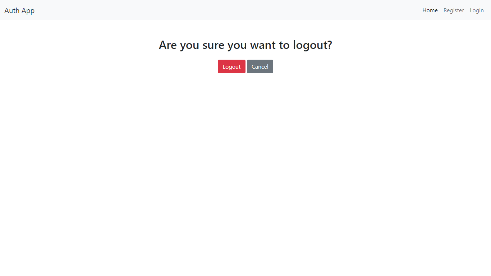

# Session-Based Authentication System with FastAPI

This project is a Session-Based Authentication System built using FastAPI. It includes features such as user registration, login, logout, profile and password reset using email-based verification. The app uses Mailtrap to handle sending password reset emails.

## Features
 - User Registration: Allows users to register with unique emails.
 - User Login: Uses session-based authentication to manage user sessions.
 - User Logout: Ends a user session securely.
 - Password Reset Request: Sends a password reset email to users who     request it.
 - Password Reset Confirmation: Allows users to reset their password using a token sent to their email.
 - Email Handling with Mailtrap: Password reset emails are sent using Mailtrap.
 - Error Handling: Implements robust error handling for scenarios such as user not found, invalid tokens, and expired tokens.


## Project Structure

```
core_app/
│
├── __init__.py
├── main.py                  # FastAPI entry point
├── database.py              # sqlite database setup
├── config.py                # Email configuration and settings management
├── .env                     # Environment variables (Mailtrap, secret keys, etc.)

user_app/
|
├── __init__.py
├── models.py                # Database models
├── schemas.py               # Pydantic schema models
├── views.py                 # User registration, login, and password
├── auth.py                  # Password hash and verify

static/
|
├── css/
├──js/
├──images/

templates/
|
├── core_app/
├── user_app/

README.md
requirements.txt         # Python dependencies
.gitignore
```
  
## Requirements

 - FastAPI: A modern web framework for building APIs with Python.
 - SQLModel: A library for interacting with SQL databases, combining the best of SQLAlchemy and Pydantic.
 - Jinja2: A templating engine for rendering HTML templates.
 - Passlib: A password hashing library to manage password security.
 - python-dotenv: A library to load environment variables from a .env file.
 - fastapi-mail: A FastAPI extension for sending emails easily.
 - Uvicorn: An ASGI server for running FastAPI applications.
 - email-validator: A library to validate email addresses.
  

## Setup

0. Development environment setup (Windows)

- Create and activate virtual environment:
   ```
   python -m venv venv
   venv\Scripts\activate
   ```

- install the required dependencies using:
  ```
    pip install -r requirements.txt
  ```

1. Environment Variables

Create a .env file in the core_app/ directory to store environment variables. Here's an example:
```
MAIL_USERNAME=mailtrap-username
MAIL_PASSWORD=mailtrap-password
MAIL_FROM=email@example.com
MAIL_PORT=587
MAIL_SERVER=smtp.mailtrap.io
MAIL_STARTTLS=True
MAIL_SSL_TLS=False
SECRET_KEY=secret-key # exampl: secrets.token_hex(32)

```

1. Database Configuration
In models.py, define User model. Here's a basic example:
```
from sqlmodel import SQLModel, Field

class User(SQLModel, table=True):
    id: int = Field(default=None, primary_key=True)
    email: str = Field(unique=True)
    hashed_password: str
    reset_token: str = None
    token_expiry: datetime = None

```

3. Running the Application
Run the FastAPI application using the following command:
```
uvicorn core_app.main:app --reload

```

4. Testing Email with Mailtrap
Mailtrap is configured to capture all email sent during development. Can log in to Mailtrap account to view the password reset emails.

## Snapshots




